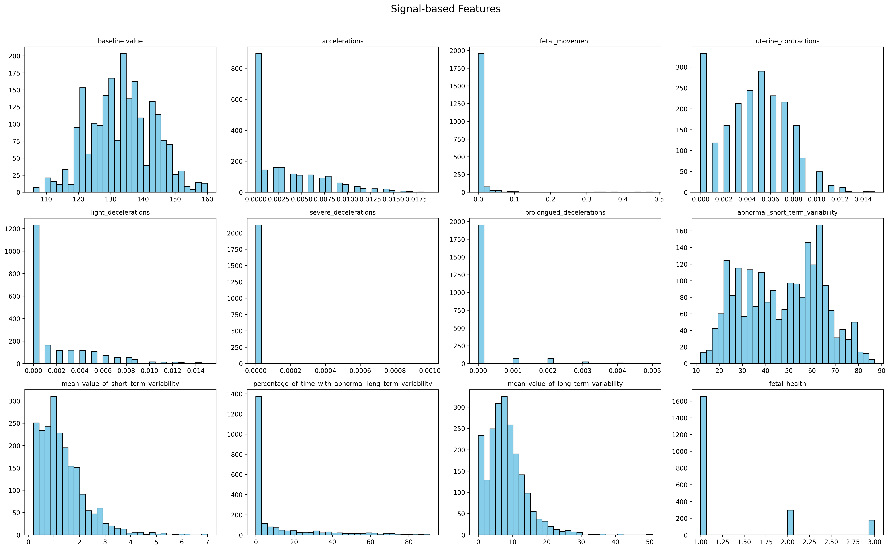
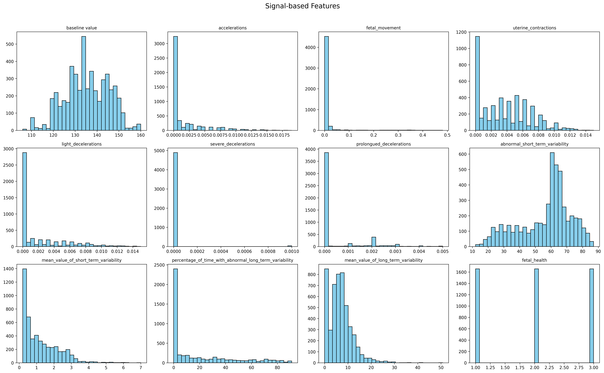
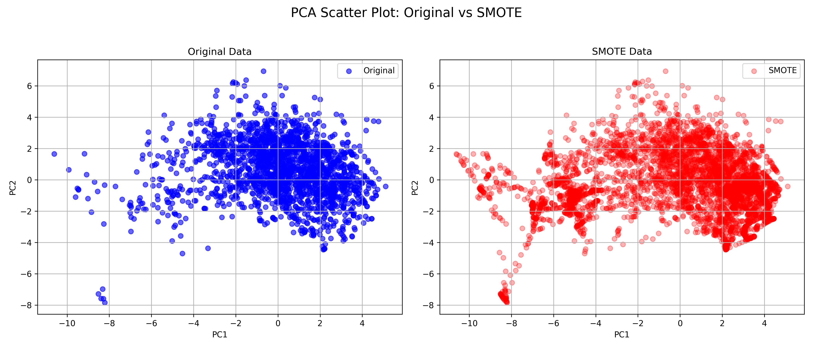

# Signal Features Analysis: Before vs After SMOTE

## Dataset Overview
- **Before SMOTE**: 2,126 samples  
- **After SMOTE**: 4,965 samples  
- Phương pháp được sử dụng: **SMOTE (Synthetic Minority Over-sampling Technique)** để cân bằng các lớp dữ liệu trong nhãn `fetal_health`.
- Trong bộ dữ liệu gốc, feature được chia làm 2 nhóm signal feature (tín hiệu của phôi thai gốc) và histogram feature (đặc trưng của phân phối tần số của nhịp tim thai nhi là histogram hiện trên màn hình máy siêu âm á)
- Target gồm 3 class: 1 (normal), 2 (suspect), 3 (pathological). Tuy nhiên trong thực tế thì tỷ lệ normal nhiều hơn hẳn suspect và pathological, nếu không oversampling và balance các class lại thì model sẽ bị bias.

---

## Class Distribution
- **Before**: Class 1 chiếm ưu thế, Class 2 và 3 ít mẫu → dữ liệu **mất cân bằng**.  
- **After**: Cả 3 class đã được tăng cường để đạt mức phân phối **cân bằng hơn** (≈1650 mẫu mỗi class).

---

## Feature Distributions

### Phân phối các signal feature trước khi áp dụng SMOTE

### Phân phối các signal feature sau khi áp dụng SMOTE

### 1. Baseline Value
- **Before**: Phân phối xấp xỉ chuẩn, trung tâm quanh 130–140.  
- **After**: Hình dạng phân phối gần như giữ nguyên, nhưng số lượng điểm dữ liệu tăng gấp đôi, giúp mô hình học được phổ biến hơn.

### 2. Accelerations
- **Before**: Phân phối lệch phải mạnh, hầu hết giá trị rất nhỏ.  
- **After**: Vẫn giữ đặc điểm lệch phải, nhưng mật độ điểm dữ liệu nhiều hơn → thuận lợi cho mô hình học.

### 3. Fetal Movement
- **Before**: Rất nhiều giá trị bằng 0, một số nhỏ >0.  
- **After**: Xu hướng vẫn giống, nhưng có nhiều điểm nhân tạo gần các giá trị gốc, giảm tình trạng thưa dữ liệu.

### 4. Uterine Contractions
- **Before**: Giá trị tập trung quanh mức thấp, phân phối lệch phải.  
- **After**: Tăng cường số lượng, giữ nguyên xu thế.

### 5. Light, Severe, and Prolonged Decelerations
- **Before**: Phần lớn giá trị gần 0, cực kỳ mất cân bằng.  
- **After**: Các điểm nhân tạo được thêm nhưng vẫn duy trì hiện tượng tập trung ở giá trị nhỏ → tránh bóp méo dữ liệu gốc.

### 6. Abnormal Short Term Variability
- **Before**: Phân phối đồng đều hơn, trải dài 20–80.  
- **After**: Giữ hình dạng phân phối, tăng mật độ dữ liệu.

### 7. Mean Value of Short/Long Term Variability
- **Before**: Các giá trị tập trung ở mức thấp (<10).  
- **After**: Hình dạng tương tự, chỉ thay đổi mật độ.

### 8. Percentage of Time with Abnormal Long Term Variability
- **Before**: Chủ yếu gần 0, một số rải rác đến ~90.  
- **After**: Vẫn lệch phải, mật độ tăng đều hơn ở vùng 0–20.

---

## Fetal Health (Target)
- **Before**: Lớp **1** (Normal) chiếm áp đảo, lớp **2** (Suspect) và **3** (Pathological) ít dữ liệu → gây mất cân bằng nghiêm trọng.  
- **After**: Ba lớp gần như bằng nhau (~1650 mỗi lớp) → cải thiện tính công bằng khi huấn luyện mô hình.

---

## Key Insights
- SMOTE đã **tăng cường dữ liệu cho lớp hiếm** mà không làm thay đổi đáng kể hình dạng phân phối của từng feature.  
- Các đặc trưng tín hiệu sinh lý vẫn giữ được **xu hướng thống kê gốc**, tránh hiện tượng dữ liệu giả tạo bị bóp méo.  
- Dữ liệu mới (4965 mẫu) **thích hợp hơn cho huấn luyện ML** do giảm bias về phân phối class.  

---

## Conclusion
- **Before SMOTE**: Dữ liệu mất cân bằng, dễ làm mô hình học thiên lệch về lớp 1.  
- **After SMOTE**: Dữ liệu cân bằng, giữ nguyên đặc điểm thống kê, hứa hẹn cải thiện **độ chính xác và khả năng tổng quát** của các mô hình ML (Logistic Regression, Random Forest, SVM, Neural Network).  

# Nhận xét PCA: Original vs SMOTE

Dựa vào PCA scatter plot:

- **Original Data (màu xanh)**: các điểm tập trung rõ ràng thành một cụm chính, với vài điểm nằm rải rác.
- **SMOTE Data (màu đỏ)**: dữ liệu được sinh ra lan rộng hơn, chiếm nhiều không gian hơn nhưng vẫn phản ánh tương đối cấu trúc chính của dữ liệu gốc.
- SMOTE mở rộng các biên dữ liệu, tạo thêm các điểm gần biên, giúp cân bằng các lớp mà vẫn giữ được mối quan hệ tổng thể trong PCA 2 chiều.

Kết luận: dữ liệu SMOTE nhìn chung giữ được cấu trúc phân phối của dữ liệu gốc, tuy nhiên có xu hướng “phủ rộng” hơn.
